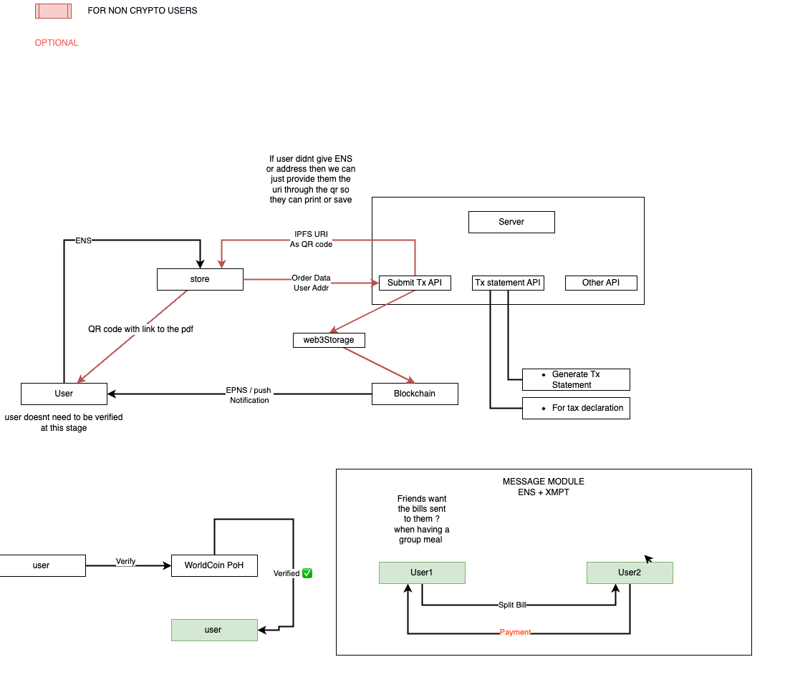

# ETH San Francisco - JomTx 📝

## What is JomTx ✨

JomTx is a protocol that acts as a ticketing server that uses Proof of Humanity , its meant to be used by web2 & web3 users. There are two agents in our protocol : Users and Stores. Non Crypto users can make use of our API to submit transactions making use of SKALE `zero gas fees` and generate a receipt that can be saved on their devices.

## Components ( Repositories )⛽️
1. [JomTx Server](https://github.com/jrcarlos2000/eth-sf-backend)
  
    submits transactions and processes receipts, provides the core API of our protocol even allowing web2 users to make use of it

2. [JomTx UI](https://github.com/Gerkep/eth-sf-frontend)

    We wanted to use a `mobile app` so that users can carry it on their smartphones wherever they go

3. [JomTx Subgraph](https://github.com/jrcarlos2000/eth-sf-subgraph)

    indexes transactions of our contract and acts as the main database of the protocol

## **Technology used:**

### **Skale**

Skale is at the core of our protocol because of the esence of its `zero gas fees`, allows us to submit any number of transactions without asking users for funds or require stores to **pay per transaction**
### **Worldcoin**

Users can make use of other features such as ( receipt-message system, active transaction list retrieval, and Tax Declaration API ) if they are verified on our protocol, We add this layer of verification using Worldcoin's Proof Of Humanity. The whole worldcoin protocol is replicated into skale and a server that mints temporary identities is enabled. 
### **ENS**

1. When the user heads to the store, it is `MORE CONVENIENT` to give an ENS handle instead of a long hexadecimal number
2. Verified users can send receipts to their friends through XMTP, ENS is useful for resolving the receiver address
### **XMTP**

Sometimes when we go on a group meal we need to take a picture of the receipt and send to our group, with XMTP integrated in our protocol, users are able to perform this with 2 clicks. No worries about pictures of your receipts, just ask your friend whats her ENS or Address and you are all set 
### **The Graph**

Receipts listed on our app are index using the graph, it is at the core of our protocol because it allows users to see the list of their transactions and stores to perform further data handling. Without the graph users wouldnt be able to see their transactions within seconds on their phones. 
## **Smart contract overview**

We have made use of the Worldcoin Protocol

Smart Contracts:

1. MockWorldID.sol: set of worldcoin protocol that is deployed on skale
2. JomTx.sol: Acts as registry and gateway to submit receipts on chain.
    
    The registry verifies that you are a Human through worldcoin POH

## **Workflow**

## **Pitch Deck**
## **Demo video**

## Deployed Contracts

### skale - eth sf

| Title                         | Address                                    |
| ----------------------------- | ------------------------------------------ |
| Verifier20                    | 0xbFA3E40AC6A75c1760130566E5b4DC5EB8890eaC |
| Poseidon library              | 0x56727656b869A48A4924596800020B9b500CB0fC |
| IncrementalBinaryTree library | 0xA2CfB62dA0071bb4d57b4Aa64Cf920a35CA99fDD |
| Semaphore                     | 0x206e2F907c54B49416CD4d26CFCdCa656E528dD2 |
| ChainStatment                 | 0x6f7cAf248770bA7dc49c6Fb13D1F10658758BED3 |
